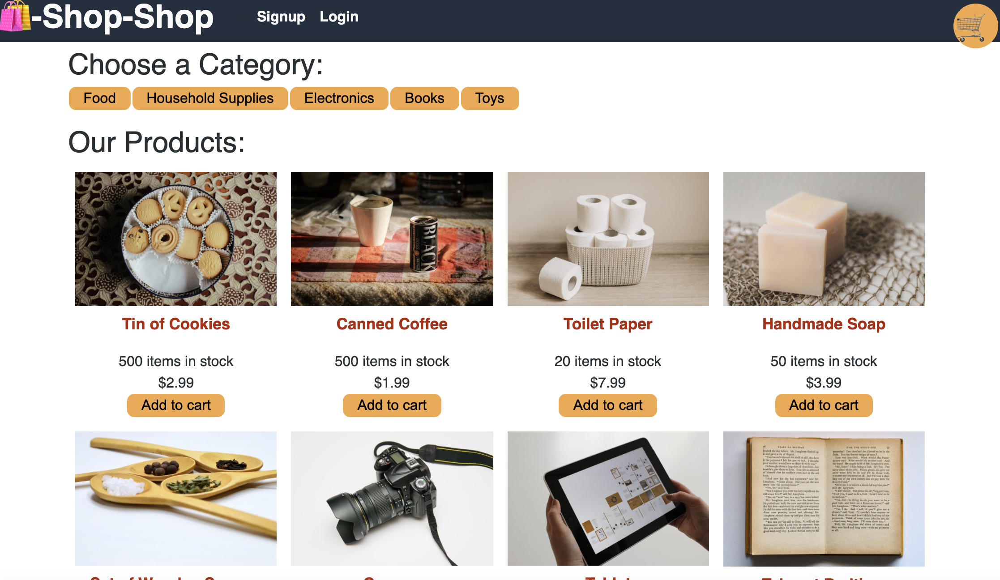

# E-Commerce Store via Redux

## Description

This e-commerce store was refactored from using a Context API to using Redux to manage global state with React. The user can register via a Signup/Login page, browse various categories, save and remove products to their Cart, view details about the products, and checkout with the implementation of Stripe.

## Table of Contents

- [Usage](#usage)
- [Technology](#technology)
- [License](#license)
- [Contact](#contact)

## Deployed Website

[Click here to use the application](https://still-savannah-23946.herokuapp.com/)

## Usage

## Technology

**1. [MongoDB](https://www.mongodb.com/)** :

- MongoDB is a general purpose, document-based, distributed database built for modern application developers and for the cloud era.

- MongoDB is a document database, which means it stores data in JSON-like documents.

**2. [React](https://create-react-app.dev/)** :

- React is a powerful and adaptable tool in creating, updating and rendering components of a web application.

**3. [Express.js](https://expressjs.com/)** :

- Web Applications : Express is a minimal and flexible Node.js web application framework that provides a robust set of features for web and mobile applications.

- APIs : With a myriad of HTTP utility methods and middleware, creating a robust API is quick and easy.

**4. [Node.js](https://nodejs.org/en/)** :

- Node.js is an open-source and cross-platform JavaScript runtime environment.

- A Node.js app is run in a single process, without creating a new thread for every request.

**5. [Redux](https://redux.js.org/tutorials/fundamentals/part-1-overview)** :

- Redux is a library that is primarily used in medium to large scale applications to help manage and update state. It centralizes a store for state that can be used across the entire applcation.

## License

This project is licensed under the terms of the MIT license.

## Contact

Let's Connect! Reach me on:

- [Github](https://github.com/evanarbour)
- [LinkedIn](https://www.linkedin.com/in/evan-arbour/)
- [Email](evan.arbour@gmail.com)
